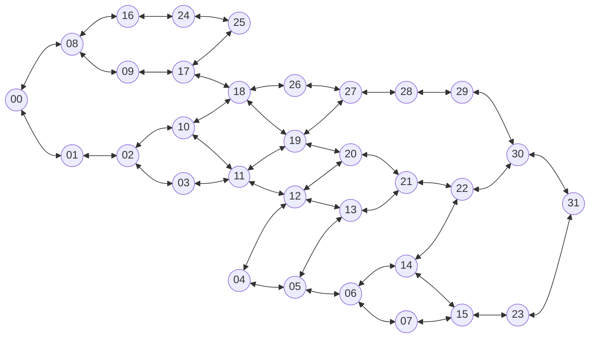

# Projet

Nom de branche : `{dossier}/{type}/nom`

Example : `db/fix/incorrect_character_encoding`

## Diagrame de la ville

```mermaid
---
config:
  graph:
    curve: linear
---
graph LR
  00((00))
  01((01))
  02((02))
  03((03))
  04((04))
  05((05))
  06((06))
  07((07))
  08((08))
  09((09))
  10((10))
  11((11))
  12((12))
  13((13))
  14((14))
  15((15))
  16((16))
  17((17))
  18((18))
  19((19))
  20((20))
  21((21))
  22((22))
  23((23))
  24((24))
  25((25))
  26((26))
  27((27))
  28((28))
  29((29))
  30((30))
  31((31))

  %% Horizontal
  00 <--> 01
  01 <--> 02
  02 <--> 03
  04 <--> 05
  05 <--> 06
  06 <--> 07
  
  08 <--> 09
  10 <--> 11
  11 <--> 12
  12 <--> 13
  14 <--> 15
  
  17 <--> 18
  18 <--> 19
  19 <--> 20
  20 <--> 21
  21 <--> 22

  24 <--> 25
  26 <--> 27
  27 <--> 28
  28 <--> 29
  29 <--> 30
  30 <--> 31


  %% Vertical
  00 <--> 08
  02 <--> 10
  03 <--> 11
  04 <--> 12
  05 <--> 13
  06 <--> 14
  07 <--> 15

  08 <--> 16
  09 <--> 17
  10 <--> 18
  11 <--> 19
  12 <--> 20
  13 <--> 21
  14 <--> 22
  15 <--> 23
  
  16 <--> 24
  17 <--> 25
  18 <--> 26
  19 <--> 27
  22 <--> 30
  23 <--> 31
```
