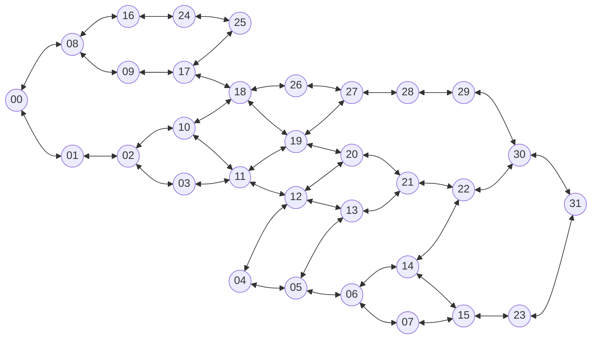

# 🚦 CityFlow Analytics - Dashboard Temps Réel (TypeScript)

Système IoT de gestion intelligente du trafic urbain avec prédiction d'embouteillages et reroutage automatique pour réduire les émissions de CO₂ de 23%.

## Diagrame de la ville


## 🚀 Démarrage Rapide

### Prérequis
- Docker & Docker Compose
- grafana
- npm
- Node JS

### Installation Locale

1. **Cloner le projet**
```bash
git clone https://github.com/Dydou1/project_m101
cd project_m101
```

### Installation des outils

### npm 
Pour utiliser les commandes npm, il faut installer npm avec les commandes suivantes :
```bash
# permet d'installer nodejs sur notre machine
sudo apt install nodejs npm
```
Ensuite, allez dans le dossier dash pour installer les dépendances.

```bash
cd dash
```
```bash
# permet d'installer les dependances
npm install
```

```bash
# permet de lancer le projet 
npm run dev
```

une fois ça terminer retourner a la racine 

```bash
cd ..
```
### 🐳Docker

Pour installer Docker, faites les commandes suivantes :

```bash
# Exécutez la commande suivante pour désinstaller tous les packages en conflit :
sudo apt remove $(dpkg --get-selections docker.io docker-compose docker-compose-v2 docker-doc podman-docker containerd runc | cut -f1)
```

```bash
# Add Docker's official GPG key:
sudo apt update
sudo apt install ca-certificates curl
sudo install -m 0755 -d /etc/apt/keyrings
sudo curl -fsSL https://download.docker.com/linux/ubuntu/gpg -o /etc/apt/keyrings/docker.asc
sudo chmod a+r /etc/apt/keyrings/docker.asc

# Add the repository to Apt sources:
sudo tee /etc/apt/sources.list.d/docker.sources <<EOF
Types: deb
URIs: https://download.docker.com/linux/ubuntu
Suites: $(. /etc/os-release && echo "${UBUNTU_CODENAME:-$VERSION_CODENAME}")
Components: stable
Signed-By: /etc/apt/keyrings/docker.asc
EOF

sudo apt update
```

```bash
sudo apt install docker-ce docker-ce-cli containerd.io docker-buildx-plugin docker-compose-plugin
``` 

### Rust
Installation de Rust :
```bash
curl --proto '=https' --tlsv1.2 -sSf https://sh.rustup.rs | sh 
```

Installation de sqlx-cli :
```bash
cargo install sqlx-cli
```

Dans le dossier iot
```bash
cd iot
docker compose --profile db up
sqlx database setup
```

### WebSocket

Connexion WebSocket pour données temps réel:
```
http://IPDELAVM:8080/ws
```
Messages reçus:
- `type: 'init'` - Données initiales
- `type: 'update'` - Mises à jour véhicules/trafic
- `type: 'predictions'` - Nouvelles prédictions
- `type: 'alerts'` - Alertes système

## 📊 Monitoring & Visualisation

### Prometheus (Port 9091)

Collecte les métriques depuis :
- **Node Exporter** (9100) - Métriques système
- **cAdvisor** (8081) - Métriques Docker
- **Postgres Exporter** (9187) - Métriques base de données

Configuration : `./moni/prometheus/prometheus.yml`

Accès : http://localhost:9091

### Grafana (Port 3002)

**Identifiants par défaut :** `admin / admin`

#### Importer les Dashboards

1. **Accéder à Grafana** → http://localhost:3002

2. **Première méthode - Import automatique (recommandé)**
   
   Les dashboards sont auto-provisionnés via Docker si les fichiers sont dans `./moni/dash/` :
   ```bash
   # Vérifier que les fichiers existent
   ls ./moni/dash/
   # Devrait afficher :
   # - Postgresql_dashboard.json
   # - vm_export_dashboard.json
   ```

3. **Deuxième méthode - Import manuel**

   **Importer le dashboard Postgresql :**
   - Aller à : Menu → Dashboards → New → Import
   - Copier le contenu de `./moni/dash/Postgresql_dashboard.json`
   - Ou cliquer sur "Upload JSON file"
   - Sélectionner la data source : Prometheus
   - Cliquer "Import"

   **Importer le dashboard VM :**
   - Même processus avec `./moni/dash/vm_export_dashboard.json`

#### Dashboards Disponibles

| Dashboard | Description | Métriques |
|-----------|-------------|-----------|
| **vm_export_dashboard.json** | Vue d'ensemble système | CPU, RAM, Disque, Réseau |
| **Postgresql_dashboard.json** | Métriques base de données | Connexions, Transactions, Cache |

#### Configurer une Data Source

Si nécessaire, ajouter manuellement Prometheus :

1. Menu → Admin → Data sources
2. Click "Add data source"
3. Sélectionner "Prometheus"
4. URL : `http://prometheus:9090`
5. Click "Save & Test"


